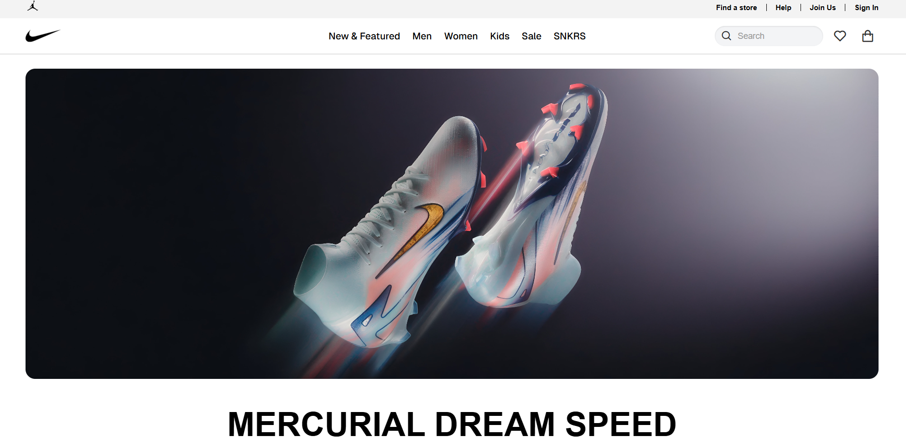
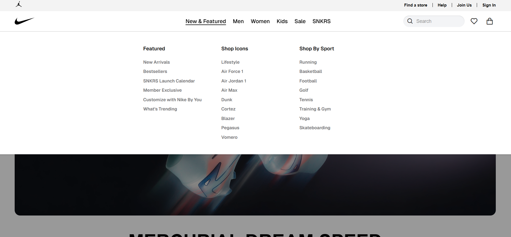
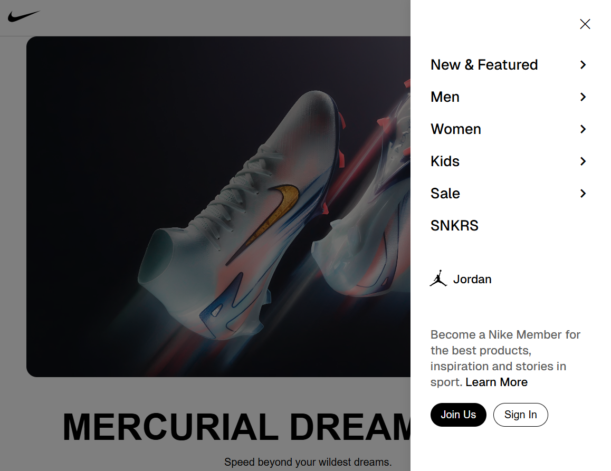

# Nike Website Clone

A responsive clone of the Nike official website built with HTML, CSS, and JavaScript.

## Project Overview

This project is a frontend implementation of the Nike website, featuring a responsive design that adapts to different screen sizes (desktop and mobile). The website includes various sections such as product showcases, navigation menus, and a footer with links to different Nike resources.

## Project Structure

```
nike-app-clone/
├── index.html            # Main HTML file
├── README.md             # Project documentation
├── assets/
│   ├── css/
│   │   ├── style.css          # Main stylesheet
│   │   ├── footer.css         # Footer-specific styles
│   │   └── back-to-top.css    # Back-to-top button styles
│   ├── js/
│   │   ├── script.js          # Main JavaScript file
│   │   ├── components.js      # Component initialization
│   │   ├── footer.js          # Footer functionality
│   │   └── back-to-top.js     # Back-to-top button functionality
│   ├── images/
│   │   ├── banner/            # Banner images
│   │   ├── screenshots/       # Screenshots for documentation
│   │   ├── section1/          # Section 1 images
│   │   ├── section2/          # Section 2 images
│   │   ├── section3/          # Section 3 images
│   │   ├── section4/          # Section 4 images
│   └── favicon/               # Favicon files
└── components/
    ├── footer.html            # Footer component
    └── back-to-top.html       # Back-to-top button component
```

## Features

- Responsive design that adapts to desktop and mobile views
- Dynamic header with scroll behaviors
- Product showcases with interactive elements
- Footer with Nike resources, help links, and company information
- Back-to-top functionality for easy navigation
- Component-based architecture for better code organization

## Technologies Used

- HTML5
- CSS3
- JavaScript (Vanilla)
- Boxicons for icons
- Font Awesome for additional icons
- Bootstrap Icons

## Usage

1. Clone the repository
2. Open `index.html` in your browser to view the website

## Implementation Details

### Components

The website uses a component-based approach with HTML components like:

- **Footer**: Contains links to Nike resources, help, company information, etc.
- **Back-to-Top Button**: Provides easy navigation back to the top of the page

### JavaScript Functionality

- **Header Scroll Behavior**: Changes header appearance based on scroll direction
- **Responsive Design**: Adapts layout for desktop and mobile views
- **Component Loading**: Dynamically loads HTML components

### Styling

- Organized CSS files for better maintenance
- Responsive design with appropriate breakpoints
- Custom styling to match Nike's brand identity

## Browser Compatibility

The website is designed to work on modern browsers including:
- Chrome
- Firefox
- Safari
- Edge

## Screenshots

### Homepage


### Homepage Dropdown


### Side Menu


## License

This project is created for educational purposes only. All Nike logos and branding elements belong to Nike, Inc. 